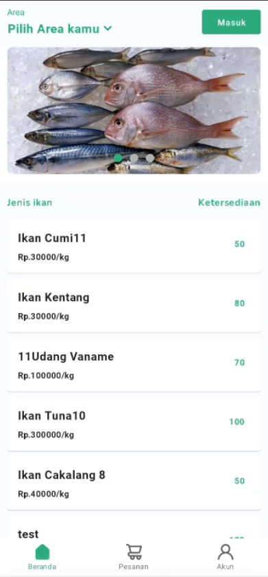
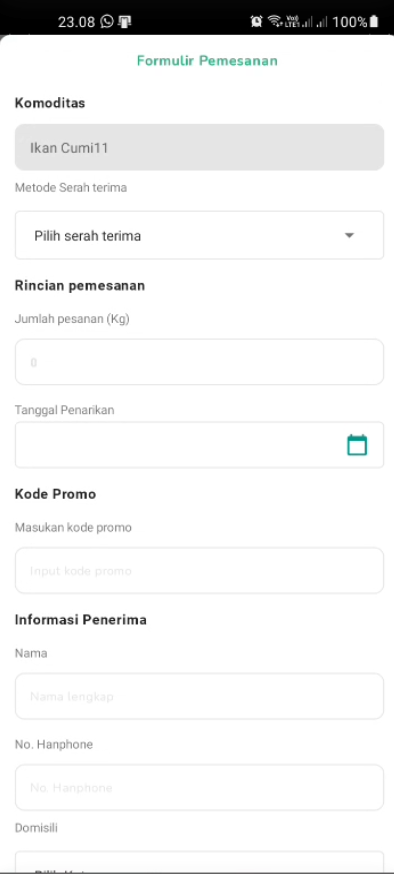

Efishery Test Documentations

Teknologi yang di pakai  
-Kotlin  
-MVVm Patern  
-DI Hilt dagger  
-XMl MaterialsDesign menngunakan constraint layout  
-Menggunakan Single Activity pada jetpack navigations component

 
 
Instalasi lewat project android studio  
- Clone repository ini  
- https://github.com/arysugiarto/EfisheryTest  (jangan lupa pilih branch, terdapat 2 branch master dan develop yang terupdate pada develop)  
- Setelah di clone buka project android menggunakan android studio lalu jalankan Run (jangan lupa emulator / device android terpasang) 

 

Instalasi lewat Apk  
-Download apk lewat link berikut  
-setelah terdownload pada device lakukan instalasi  
-tunggu sampai selesai dan aplikasi siap digunakan

 
 

Petunjuk penggunaan  
 
                 

Terdapat dropdown ke bawah pada toolbar itu di tunjukan untuk ke halaman area
  

                 

Jika Item di klik pada halaman area misal jawa barat nantinya bakal muncul pada toolbar home
 

Jika pada home salah satu jenis ikan di klik maka akan mengarah ke halaman detail ikan
  

                 

Untuk memesan ikan tersebut pengguna bisa klik button pesan sekarang yang ada di bawah  

                 

Pengguna harus mengisi formulir pemesanan jika formulir sudah terisi pengguna bisa klik pesan pada button di bawah (harus scroll karena form banyak) 

                 

untuk melihat pesanan pengguna bisa klik bottom navigations pesanan yang ada di bawah maka akan menuju halaman list pesanan  

